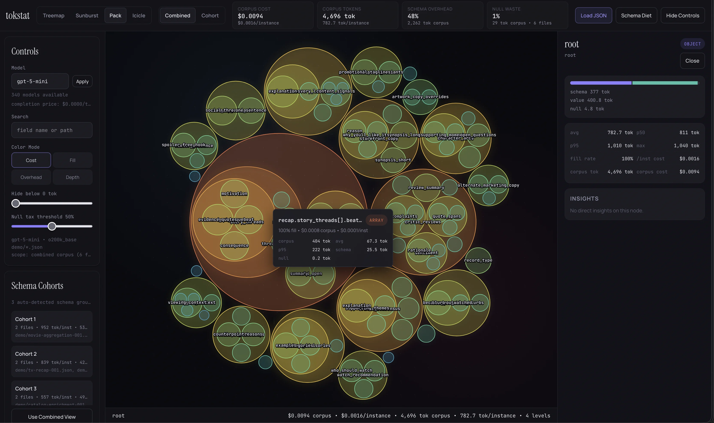

# tokstat

A beautiful, interactive explorer for the token economics of your LLM-generated JSON.

Point it at a corpus of structured outputs and see exactly where your tokens — and dollars — are going. Treemap, sunburst, circle pack, or icicle chart. Click into any field to drill down. Animated transitions between views. Every interaction designed to make schema auditing something you want to do, not something you have to.

```bash
npx tokstat
```

## Bakeoff

This project is currently a bakeoff between two AI coding agents building the same tool from the same spec:

| Branch | Agent | Model |
|--------|-------|-------|
| [`claude/tokstat`](https://github.com/TomNeyland/tokstat/tree/claude/tokstat) | Claude Code | Opus 4.6 |
| [`codex/tokstat`](https://github.com/TomNeyland/tokstat/tree/codex/tokstat) | Codex | GPT 5.3 (high) |

Both start from the same design system, specs, and fixtures. Same requirements, different implementations.

**Claude Code (Opus 4.6):**


**Codex (GPT 5.3 high):**



**Live demo:** [tomneyland.github.io/tokstat](https://tomneyland.github.io/tokstat/)

## What it does

You're running structured generation (OpenAI, Anthropic, Gemini) with JSON schemas. You're spending hundreds or thousands of dollars per run. You have no idea which fields cost what, which optional fields are rarely populated, or whether your 200-character field names are bleeding you dry.

tokstat reads your generated JSON files, walks the schema hierarchy, tokenizes every field name and value, and gives you an interactive visualization of where the weight is.

**Per-field analytics:**
- Token count: avg, min, max, p50, p95 across your corpus
- Fill rate for optional/nullable fields
- Schema overhead (field names, braces, brackets, colons, commas) vs. value payload
- Estimated cost per field per model/provider

**Multiple visualization modes:**
- **Treemap** — where is the money going (relative area = relative cost)
- **Sunburst** — drill into nested structure radially
- **Circle pack** — spot outliers and clustering
- **Icicle** — linear depth exploration

Animated transitions between views. Click any node to zoom into that subtree.

## Install

```bash
npm install -g tokstat
# or
npx tokstat ./path/to/files/**/*.json
```

## Usage

```bash
# Point at JSON files
tokstat ./outputs/**/*.json

# Specify model for cost estimation
tokstat ./outputs/**/*.json --model gpt-4o

# JSON output for LLM consumption / CI pipelines
tokstat ./outputs/**/*.json --format json

# LLM-optimized context output
tokstat ./outputs/**/*.json --format llm
```

## Stack

- **Analysis**: Node/Bun — file walking, schema inference, tokenization (js-tiktoken)
- **Visualization**: Svelte 5 + D3 layouts — reactive rendering with hand-crafted SVG
- **Distribution**: npm package, opens local browser. No Electron, no desktop wrapper.

## License

MIT
